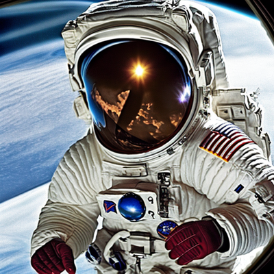

# Text2ImageGenerator - Deep Art Generation with Stable Diffusion

This project demonstrates the generation of artistic images using Stable Diffusion, a generative model, and leverages Hugging Face's Transformers library for natural language prompts.

## Overview

The project consists of Python code using PyTorch, Diffusers, and Transformers libraries to create an art generation pipeline. The Stable Diffusion model is used for image generation based on textual prompts.

## Setup

1. Install the required dependencies:

    ```bash
    pip install --upgrade diffusers transformers -q
    pip install --upgrade torch
    pip install opencv-python
    pip install accelerate
    ```

2. You can download this ipynb file and execute in your environment.

## Configuration

The `CFG` class in the script contains various configurations:

- `device`: Specify the device for computation, either "cuda" or "cpu".
- `seed`: Set the seed for random number generation.
- `generator`: Set the torch generator for reproducibility.
- `image_gen_steps`: Number of inference steps for image generation.
- `image_gen_model_id`: Hugging Face model ID for Stable Diffusion.
- `image_gen_size`: Size of the generated image.
- `image_gen_guidance_scale`: Scale for guidance during image generation.
- `prompt_gen_model_id`: Hugging Face model ID for text prompts.
- `prompt_dataset_size`: Size of the prompt dataset.
- `prompt_max_length`: Maximum length of generated prompts.

## Usage

The script demonstrates how to generate images based on a textual prompt. Modify the `generate_image` function call with your desired prompt.

```python
generate_image("astronaut in space", image_gen_model)
```

## Project Preview

Here is an example image generated by our project:



## License

This project is licensed under the [MIT License](https://github.com/git/git-scm.com/blob/main/MIT-LICENSE.txt) - see the [LICENSE](https://github.com/git/git-scm.com/blob/main/MIT-LICENSE.txt) file for details.

## Acknowledgments

- [Hugging Face Transformers](https://huggingface.co/transformers/): The Transformers library provides state-of-the-art natural language processing models.
- [Stable Diffusion](https://github.com/Stability-AI/stablediffusion): Stable Diffusion is a generative model used for image generation.
- OpenCV: OpenCV is used for image processing in this project.
- Accelerate: Accelerate is a PyTorch library for high-performance computing.

Special thanks to the authors and contributors of the above libraries and tools for their valuable contributions to the open-source community.

Special thanks to reference repository - [TextToImageGenerator](https://github.com/MandeepKharb/Youtube/blob/main/GenerativeAI/TextToImageGenerator.ipynb) 
